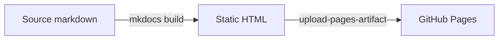

# Documentation writing standard

This file defines how documentation is written across every repository. It is
about **prose**: voice, structure, and what belongs on a page. The mechanics of
which files to create and how to migrate an existing `docs/` folder are in
[`ROLLOUT.md`](https://github.com/willtheorangeguy/mkdocs/blob/main/ROLLOUT.md).

Read this before writing any page. It ships into every project repo as
`docs/docs.instructions.md`, so a session working in that repo finds it without
needing the template checked out.

---

## Audience

**Developers.** Assume programming literacy and command-line fluency. Assume
zero familiarity with *this* project.

- Never explain what a terminal, a package manager, or an environment variable
  is.
- Always explain what *this project's* flags, files, and concepts mean, even
  when the name looks self-evident.
- When a project has non-developer users too, write for the developer and add a
  short, clearly-labelled section for the rest. Do not lower the whole page.

The reader arrived from a search engine, a README badge, or a broken build.
They want one specific answer. Write so they can find it without reading the
page top to bottom.

---

## Voice and style

| Rule | Do | Don't |
|---|---|---|
| Person | "You run `build`" | "The user runs `build`" |
| Voice | "The parser reads the file" | "The file is read by the parser" |
| Tense | "The command returns 0" | "The command will return 0" |
| Mood | "Install the package" | "You should install the package" |
| Case | "Getting started" | "Getting Started" (headings) |

Contractions are fine — "doesn't" reads better than "does not".

**Banned words.** These either condescend or add nothing:

> simply · just · easy · easily · obviously · of course · note that · basically ·
> as you can see · it should be noted

If a step is genuinely easy the reader will notice without being told. If it
isn't, the word is a lie. Delete the word; the sentence is almost always
stronger.

**No marketing language.** This is reference material, not a product page. No
"powerful", "seamless", "blazing fast", "revolutionary". State what the thing
does and let the reader judge.

**Short sentences.** One idea each. If a sentence needs a semicolon to hold
together, it usually wants to be two sentences.

**Front-load.** Put the answer in the first sentence of a section, then the
qualifications. Readers scan; they should not need the second paragraph to learn
whether the first one applies to them.

---

## Heading conventions

- **Exactly one H1 per page**, on the first line, matching the page's nav label.
- **H2** for major sections, **H3** for subsections. **H4 is discouraged** and
  nothing below it is allowed. Four levels of nesting means the page should be
  split.
- **Sentence case.** "Configuration file" not "Configuration File".
- **No numbered headings.** The table of contents handles ordering; manual
  numbers rot the moment a section is inserted.
- **Unique within a page.** Duplicate headings collide on permalink anchors and
  the second one becomes unreachable. Sibling repeats under different parents
  are fine.
- **No trailing punctuation**, except a question mark in FAQ entries.
- Headings are navigation, not prose. "Environment variables" beats "How to
  configure the tool using environment variables".

---

## Code blocks

**Always tag the language.** An untagged fence fails lint and loses syntax
highlighting.

**Never include prompt prefixes.** No `$`, no `>`, no `PS>`. The copy button is
enabled site-wide and a prompt character breaks paste.

```bash
pip install lego-block-creator
```

**Separate commands from output.** Two blocks, not one, so the command stays
copyable.

```bash
mkdocs build --strict
```

```text
INFO - Documentation built in 1.42 seconds
```

**Name a block that is a file** with the `title` attribute:

````markdown
```yaml title="mkdocs.yml"
site_name: Example
```
````

**Use tabs for per-platform instructions**, never sequential prose:

````markdown
=== "Windows"

    ```powershell
    py -m pip install example
    ```

=== "macOS / Linux"

    ```bash
    python3 -m pip install example
    ```
````

### Two syntaxes that will break your build

The macros plugin evaluates Jinja in all markdown, and the snippets extension
processes include markers everywhere — **including inside code blocks**.

- A literal `{{` or `{%` in a sample is parsed as a macro. Wrap the block in a
  raw tag so it is passed through untouched.
- A literal include marker at the start of a line is parsed as an include.
  Prefix it with a semicolon to escape it: `;--8<--` renders as the marker
  itself.

These are the two most common causes of a confusing CI failure on a page that
looks fine locally.

---

## Diagrams

**Use Mermaid, never an image of a diagram.** Images don't reflow, don't survive
dark mode, can't be searched, and go stale in a way nobody notices.

````markdown

````

**When a diagram earns its place:** architecture and data flow, state machines,
request/response sequences, CI pipelines. Anything where the *relationships*
carry the meaning.

**When it doesn't:** a list of components (use a list), a set of values (use a
table), a linear procedure (use numbered steps). A diagram of a list is worse
than the list.

Rules:

- **Under ~12 nodes.** Past that, split into two diagrams or describe the
  structure in prose. A wall of boxes communicates nothing.
- **Label every edge.** An unlabelled arrow makes the reader guess the
  relationship.
- **Never hardcode colours.** The theme supplies them; hardcoded fills go
  unreadable when the reader flips to dark mode.
- **Introduce it in a sentence.** A diagram with no lead-in makes the reader
  reverse-engineer its purpose.

---

## When to include examples

Examples are not decoration. The rules are absolute:

- **Every configuration option gets an example value.** A type and a
  description do not tell the reader what a valid value looks like.
- **Every command gets one complete, runnable invocation.** Not a synopsis with
  placeholders — a line that works if pasted.
- **Every API entry gets a call and its response.**
- **A core page with no example is a defect.**

**Examples must be real.** Draw them from the repo's actual code, tests, README,
or CI logs. An invented example that doesn't run is worse than no example: it
costs the reader the time to try it *and* their trust in the rest of the page.

If you cannot find a real example, write:

```markdown
<!-- TODO: add a worked example — none found in README, tests, or source -->
```

A TODO is honest. Invented prose is a bug that ships.

---

## Writing an FAQ

Every repo gets an `faq.md`, whether or not anyone has asked a question yet.
Waiting for real questions means the page never gets written for the quiet
repos, which are exactly the ones where a reader has nowhere else to turn.

**Anticipate the question, never invent the answer.** These are different acts,
and only the second one is forbidden:

- Predicting *what* someone will ask is judgement, and you have the evidence to
  do it well — you have just read the source, the tests, and the workflows.
- Inventing *what the software does* is a defect, exactly as it is on every
  other page. Every answer must trace to something you verified.

If you cannot answer a question from verified behaviour, the question does not
belong on the page.

### Where good questions come from

Work from what the code told you, in roughly this order of value:

1. **Surprises you hit while reading the source.** If a behaviour surprised
   you, it will surprise the reader. A CLI that keeps nothing after it exits, a
   container that bakes files in at build time, a command that must be run
   before another — each is a question waiting to happen.
2. **Gaps between what the README promises and what the code does.** Readers
   arrive believing the README.
3. **The first five minutes.** Install fails, the command is not on `PATH`, the
   program exits immediately, nothing appears on screen.
4. **Decisions the reader must make.** Which install method, which image tag,
   which of two spellings.
5. **Anything a placeholder, prompt, or error message hints at.** If the code
   prints "make sure this colour is in the database", someone has hit that.

### What does not belong

- Questions whose answer is "read the installation page". An FAQ is for things
  that are genuinely confusing, not a second table of contents.
- Padding to reach a count. Four sharp entries beat twelve filler ones.
- Anything you would have to guess at. Leave a `<!-- TODO -->` instead.

### Shape

Phrase each entry as the reader would actually type it into a search box —
"Why did my data disappear?", not "Data persistence". Use `???+ question` for
the first entry so the page opens with something visible, `???` for the rest.
Put failures with a visible symptom under Troubleshooting instead, keyed on the
error text.

## Documenting APIs

Pick the form that matches the project's actual interface.

### Python

Rely on `mkdocstrings`. Write **Google-style docstrings in the source** rather
than duplicating signatures in markdown — a hand-copied signature is wrong the
first time the code changes.

```markdown
::: mypackage.core
    options:
      members:
        - Parser
        - load
```

`api.md` supplies the narrative around the generated blocks: what the module is
for, which entry point to start with, how the pieces fit. It does not restate
what the docstrings already say.

### Command-line

One table per command, plus a usage example. Never prose-describe flags.

| Flag | Type | Default | Description |
|---|---|---|---|
| `--output` | path | `./out` | Directory for generated files |
| `--verbose` | flag | off | Print each file as it is written |

### HTTP

For each endpoint: method and path, parameters, request body, response body,
and the status codes it actually returns — including the error cases. An
endpoint reference that documents only the happy path is half-written.

---

## Documenting configuration

**One reference table per source**, with these exact columns:

| Option | Type | Default | Description |
|---|---|---|---|
| `log_level` | string | `info` | One of `debug`, `info`, `warning`, `error` |
| `timeout` | integer | `30` | Seconds before a request is abandoned |

- **State the precedence order explicitly**, once, at the top of the page:
  CLI flag > environment variable > config file > default. Readers debugging a
  setting that "isn't applying" are almost always hitting precedence.
- **Give the environment-variable naming scheme once** ("uppercase the option
  and prefix `APP_`"), then don't repeat it per row.
- **Enumerate valid values** for anything that isn't free-form. "One of
  `debug`, `info`, `warning`, `error`" beats "the log level".
- **Say what happens on an invalid value** — ignored, warned, or fatal.

---

## Admonitions

| Type | Use for |
|---|---|
| `note` | An aside the reader can skip |
| `tip` | An optional improvement |
| `warning` | Something that will cause a problem |
| `danger` | Data loss, security, or anything irreversible |
| `example` | A worked case |
| `question` | An FAQ entry |

```markdown
!!! warning
    Deleting the cache directory forces a full re-index on next start.
```

- **One per point.** Never stack two in a row — the second stops registering.
- **Never decorative.** An admonition around ordinary prose trains readers to
  skip all of them, including the `danger` one that matters.
- **Three per page is a lot.** More than that means the page structure is
  fighting the content.

---

## Links and terminology

- **Relative `.md` links internally**: `[configuration](configuration.md)`. The
  build validates these, so a rename that breaks a link fails CI instead of
  shipping a 404.
- **Absolute URLs for external links.**
- **Never bare URLs.** `[the Docker docs](https://docs.docker.com/)`, not the
  raw address.
- **Link the first mention** of another page in a section, not every mention.
- **Capitalize the product name consistently** within a repo. Pick the form the
  README uses and never vary it.
- **Backticks** for file paths, identifiers, flags, values, and commands.
- **Bold** for UI elements the reader clicks: press **Save**.
- **Define an acronym on first use** per page. Readers arrive mid-site.

---

## What not to do

- **Don't invent.** No features, flags, install methods, or return values that
  you have not seen in the source, tests, README, or workflows. This is the
  single most damaging failure mode: invented documentation is indistinguishable
  from real documentation until someone tries it. Anticipating a *question*
  nobody has asked yet is fine and expected — see [Writing an FAQ](#writing-an-faq);
  inventing the *answer* is not.
- **Don't duplicate root files.** `CHANGELOG.md`, `CONTRIBUTING.md`,
  `SECURITY.md`, `CODE_OF_CONDUCT.md`, and `LICENSE.md` are pulled in by
  reference. Copying them creates two versions that drift.
- **Don't editorialize about the code.** No "this is a bit hacky", no "ideally
  this would be refactored". Document what it does.
- **Don't write filler.** A section that restates its own heading in a sentence
  should be deleted, not padded.
- **Don't rewrite the README's voice.** Reorganizing existing content into pages
  is not a licence to restyle prose that already works.
- **Leave a TODO where information is missing.** Never plausible-sounding
  guesses.

---

## Per-page contract

The required structure for each core page. This is what makes 130 sites
consistent structurally, not just tonally. Sections marked *optional* are
dropped when they don't apply; the rest are required.

### `index.md` — Home

```markdown
# <Project name>

<One paragraph: what it is, who it's for, what problem it solves.>

## Key features
<3-8 bullets. Concrete capabilities, not adjectives.>

## Quick start
<The shortest command sequence that produces a result. Link to
getting-started.md for the full path.>

## Where to next
<Card grid linking to the main sections.>

## Support
<Standard support block.>
```

### `getting-started.md`

Assumes nothing. Takes the reader from zero to one working result.

```markdown
# Getting started
## Prerequisites          <- exact versions, and how to check them
## Install                <- the single recommended path; link installation.md for the rest
## First run              <- numbered steps, each with a command and its expected output
## What just happened     <- brief explanation of the result
## Next steps             <- links onward
```

The test: someone who has never seen the project follows this page start to
finish and gets a working result without opening another page.

### `installation.md`

```markdown
# Installation
## Requirements           <- OS, runtime versions, system dependencies
## <One tabbed block per method>   <- executable / package manager / Docker / source
## Verify the installation         <- a command and the output proving it worked
## Upgrading
## Uninstalling
```

Every method the project actually supports gets a tab. Do not document an
install path that has not been verified to exist.

### `configuration.md`

```markdown
# Configuration
## Precedence             <- stated once, explicitly
## <Reference table per source>    <- config file / env vars / CLI flags
## Examples               <- at least one complete, working configuration
## Troubleshooting        <- optional
```

### `architecture.md`

```markdown
# Architecture
## Overview               <- one Mermaid diagram plus a lead-in paragraph
## Components             <- one H3 per major component: responsibility and boundaries
## Data flow              <- how a request or run moves through the system
## Directory layout       <- annotated tree of the significant paths only
## Design decisions       <- optional: what was chosen, and what it was chosen over
```

Written for someone about to modify the code. "Directory layout" lists the
paths that matter, not every file.

### `api.md`

Structure follows the interface type — see [Documenting APIs](#documenting-apis).
Always opens with a paragraph on what the public surface is and where to start.

### `contributing.md` and the About group

One line each — an include of the root file. No wrapper prose, no heading of
their own: the root file supplies its own H1.

---

## Checklist

Before considering a page done:

- [ ] One H1, matching the nav label
- [ ] No banned words
- [ ] Every code fence has a language tag and no prompt prefix
- [ ] Every option, command, and endpoint has a real example
- [ ] Internal links are relative `.md` paths
- [ ] No invented features, flags, or behaviour
- [ ] `mkdocs build --strict` passes with zero warnings
